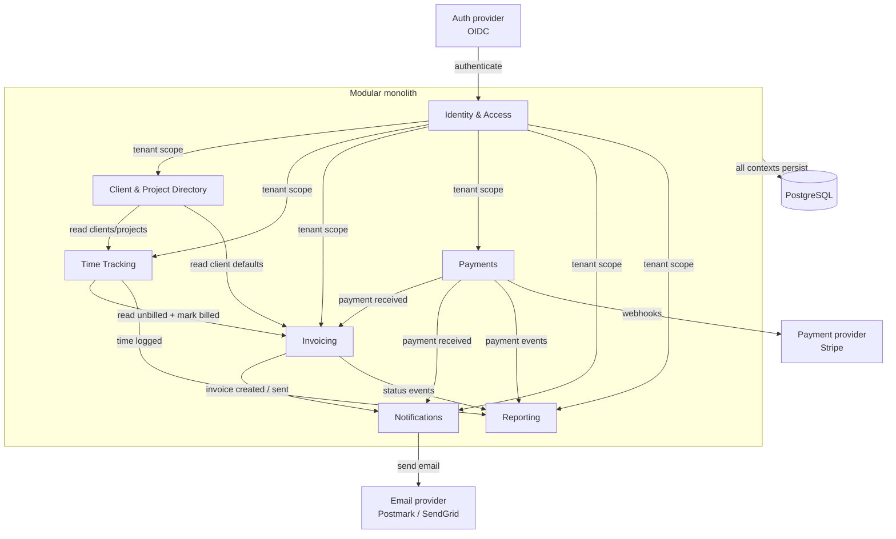

# Dependency Map

*Dependencies between bounded contexts and external services for the freelancer SaaS modular monolith. Owned by the Tech Lead; updated when ADRs or RFCs change cross-context contracts.*

## Bounded contexts

| Context | Role in Bet 1 | Primary dependencies |
|---|---|---|
| Identity & Access Management | Resolves `tenant_id` for every request | Auth provider (OIDC) |
| Client & Project Directory | Provides master data for quick-entry and invoices | IAM (tenant scope) |
| Time Tracking | Captures and rounds billable time | Client & Project Directory (read-only), IAM |
| Invoicing | Creates invoices from unbilled entries | Time Tracking (transactional), Client & Project Directory (read-only), IAM |
| Payments | Records payments and updates invoice status | Invoicing (event-driven), Payment provider (webhooks) |
| Notifications | Sends invoice/reminder emails | Invoicing, Payments (event-driven), Email provider |
| Reporting | Aggregates dashboard data | Time Tracking, Invoicing, Payments (read-only) |

## Dependency diagram

## Coupling table

| Consumer | Provider | Dependency type | Coupling | Notes |
|---|---|---|---|---|
| All contexts | IAM | `tenant_id` resolution | Loose | Passed via auth middleware; no runtime calls required after request setup. |
| Time Tracking | Client & Project Directory | Read client/project metadata | Loose | Through internal port; only IDs and display names. |
| Invoicing | Time Tracking | Read unbilled entries + mark billed | Tight (transactional) | Must succeed/fail atomically; uses a single local transaction. |
| Invoicing | Client & Project Directory | Read client defaults (rate, currency) | Loose | Through internal port; cached where appropriate. |
| Payments | Invoicing | Update invoice status | Loose (event-driven) | Payment context publishes events; invoicing updates status idempotently. |
| Notifications | Invoicing / Payments | Trigger emails | Loose (event-driven) | Subscribes to domain events; failures do not block transactions. |
| Reporting | Time Tracking / Invoicing / Payments | Read-only aggregates | Loose | Uses dedicated read models / materialized views; never writes. |

## External services

| Service | Used by | Purpose | Coupling |
|---|---|---|---|
| OIDC identity provider (e.g., Auth0, Clerk) | IAM | Authenticate freelancers and resolve tokens | Replaceable behind auth adapter. |
| PostgreSQL | All contexts | Single source of truth for transactional data | Runtime dependency; schema migrations owned by backend squad. |
| Transactional email provider (e.g., Postmark, SendGrid) | Notifications | Send invoice and reminder emails | Replaceable behind notification adapter. |
| Payment provider (e.g., Stripe) | Payments | Record card/ACH payments via webhooks | Not required for Bet 1; defined for future boundary. |

## Bet 1 scope highlight

Only the solid-line dependencies in the diagram are exercised during Bet 1:

1. Freelancer authenticates via OIDC → IAM.
2. Quick-entry widget reads clients/projects from **Client & Project Directory**.
3. Time entry is saved in **Time Tracking**.
4. Invoice creation calls **Time Tracking** to fetch unbilled entries and atomically marks them `billed`.
5. **Reporting** optionally surfaces unbilled hours on the dashboard.

Payments, Notifications, and the payment-provider webhook are out of scope for Bet 1 but are included so the boundary model stays stable as the product grows.
